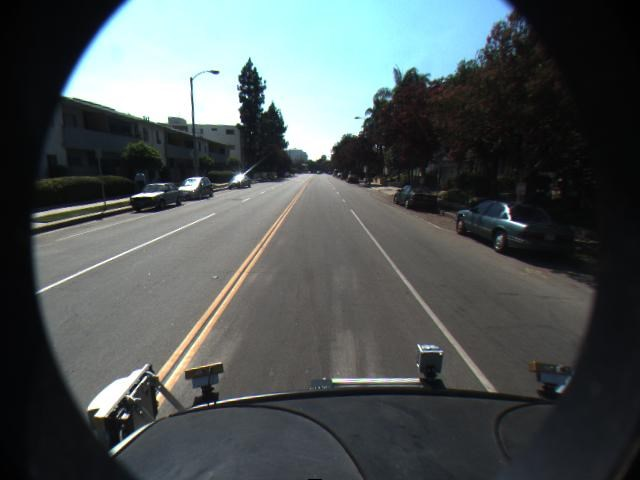

# FPGA_BirdsEyeView

* The Simulink model generates HDL files for Bird's Eye View (Perspective Transform) IP core with AXI4 streaming interface.

* Please cite this work as follows

Muhammad Bilal, 'A Resource-Efficient FPGA Implementation of Perspective Transformation for Bird’s Eye View Generation using High-Level Synthesis Framework', IET Circuits, Devices & Systems, 2019. 

https://digital-library.theiet.org/content/journals/10.1049/iet-cds.2018.5263

